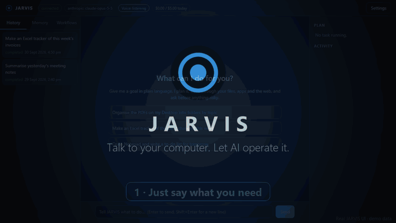
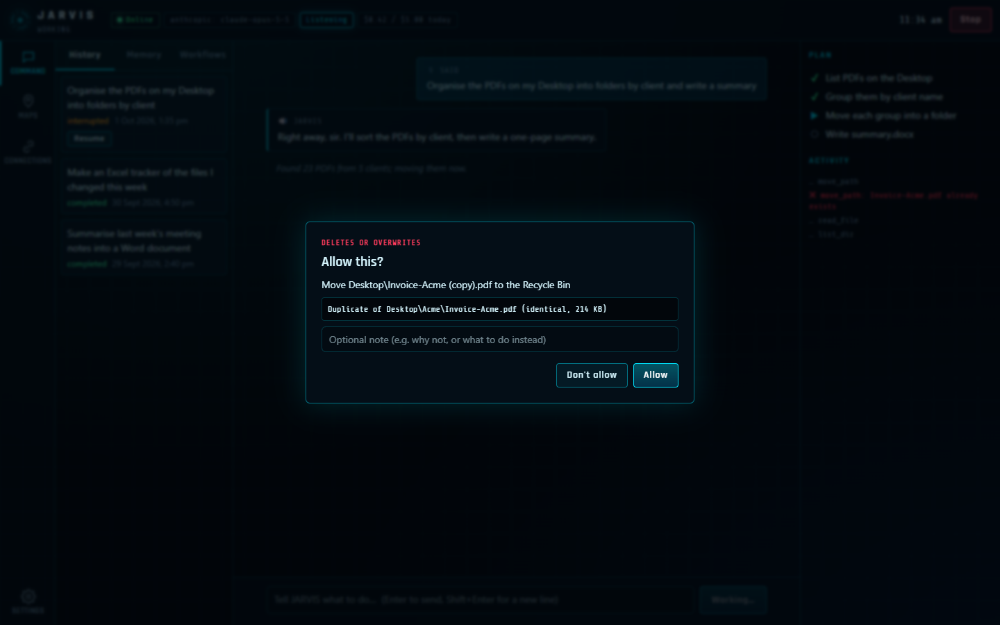
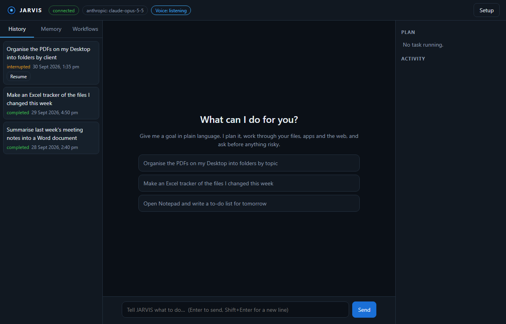
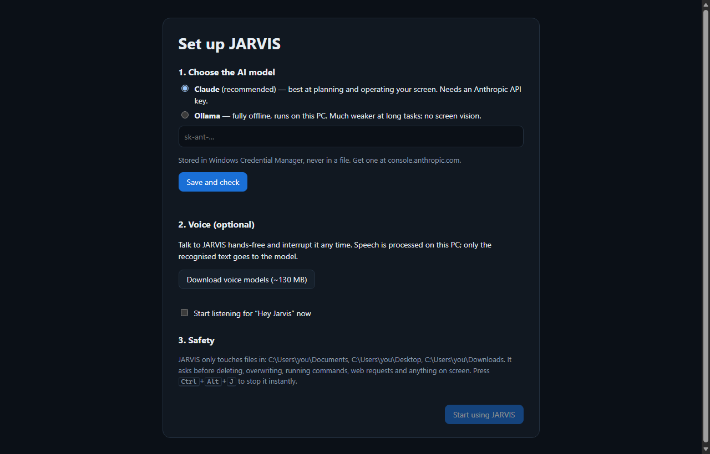

# JARVIS

An AI control layer for Windows. Give it a goal in plain language — by voice or text — and it
plans the steps, operates your apps, files, browser and terminal, watches the screen to verify
each step, and reports back. Full-duplex voice means you can interrupt it mid-sentence.

> **Version 2.0.** A desktop app with a tray icon, full-duplex voice, screen control,
> memory and saved workflows, now personalised to each user by a setup wizard. Talk to JARVIS, interrupt it mid-sentence, and change your
> instruction on the fly. It plans and works through files, Office documents, email drafts,
> the shell, the web and any app on screen, under a safety layer, and tells you what it did.
> See [CHANGELOG.md](CHANGELOG.md).



▶ **[Watch the 50-second video with narration](docs/media/jarvis-demo.mp4)**

<sub>Real JARVIS UI with demo data; narration in JARVIS's own on-device voice.</sub>

## Screenshots

**At work:** the live plan, the activity feed, and an approval before anything risky. The
request here came by voice.



**Home:** type a goal, or say "Hey Jarvis". History (with Resume for interrupted tasks),
memory and saved workflows are on the left.



**First-run setup (v2.0):** a seven-step wizard that sets your name, how JARVIS addresses
you, its personality, the model, the voice and your features and budget. Each feature is a
tick box; the ones arriving in later versions are saved now and switch on when they
ship.



<sub>Rendered from the app's actual UI code with sample data.</sub>

## Quick start

You need **one key: an Anthropic API key** (or nothing, if you use offline Ollama).

**Get the API key:** go to [console.anthropic.com](https://console.anthropic.com), sign in,
add a payment method under **Billing**, then open **API Keys → Create Key**. Copy the key;
it starts with `sk-ant-`. Set a monthly spend limit under Billing so there are no
surprises: Claude usage is billed per use.

### Option A: Installer (recommended)

**First time**
1. Download `JarvisSetup-<version>.exe` from
   [Releases](https://github.com/Thrya29/jarvis-/releases/latest) and run it. Tick **"Start
   JARVIS in the tray when I sign in"** if you want it to start by itself every day.
2. The setup screen opens:
   - Choose **Claude**, paste your key, and click **Save and check**.
   - Optional: **Download voice models (~130 MB)** for "Hey Jarvis".
   - Click **Start using JARVIS**.

**Every day**
- If you ticked start-at-sign-in: nothing to do. JARVIS is in the tray; click the icon to
  open it.
- Otherwise: **Start menu → JARVIS**.

### Option B: From source

**First time** (PowerShell, in the repo folder):
```powershell
git clone https://github.com/Thrya29/jarvis-.git   # or: git pull, if you already have it
cd jarvis-
python -m pip install --user uv            # once per PC
uv sync                                    # install dependencies
uv run jarvis secret set ANTHROPIC_API_KEY # paste the key (stored in Windows Credential Manager)
uv run jarvis voice setup                  # optional: voice models
uv run jarvis doctor                       # everything should say OK
```

**Every day**
```powershell
uv run jarvis app       # window + tray (the normal way)
```
Or pick one of these instead:
```powershell
uv run jarvis chat      # text chat in the terminal
uv run jarvis voice     # hands-free in the terminal
uv run jarvis do "organise my Desktop PDFs into folders"   # one task, then exit
```

### Good to know
- **Stop anything instantly:** press **Ctrl+Alt+J**.
- **No API key?** Install [Ollama](https://ollama.com), run `ollama pull qwen2.5:3b`, and
  choose **Ollama** in setup. It's free and offline, but much weaker and can't see the
  screen.
- **Something wrong?** Run `jarvis doctor` (or Start menu → **JARVIS Doctor**). It tells
  you what's missing.

## Requirements

- Windows 10 (22H2) or Windows 11, x64
- 8 GB RAM minimum (16 GB recommended for local speech models + Ollama)
- One LLM backend:
  - **Anthropic API key** (default, recommended — best planning and screen understanding), or
  - **[Ollama](https://ollama.com)** running locally (fully offline; text tasks only on CPU-class hardware)

## Install

### From a release (end users)

1. Download `JarvisSetup-<version>.exe` from the
   [Releases](https://github.com/Thrya29/jarvis-/releases) page and run it. It installs per
   user, with no admin rights needed. Optionally, tick "Start JARVIS in the tray when I
   sign in". `SHA256SUMS.txt` next to it lets you verify the download.
2. JARVIS opens its window with a short **setup**:
   - Choose Claude (paste an Anthropic API key, which is checked before it's saved) or
     offline Ollama.
   - Optionally download the voice models (~130 MB).
3. Type a goal, or turn on **Voice** and say "Hey Jarvis, …".

Closing the window keeps JARVIS in the tray. Open it again from the Start menu or the tray
icon, whose menu also has *Voice on/off*, *Stop current task* and *Quit*.

### From source (developers)

```powershell
python -m pip install --user uv
git clone https://github.com/Thrya29/jarvis-.git
cd jarvis-
uv sync
uv run jarvis doctor
```

## Command line

The installer can add `jarvis` to your PATH. Everything the app does is also available
from a terminal:

```powershell
jarvis config init                          # writes %LOCALAPPDATA%\Jarvis\Jarvis\config.toml
jarvis secret set ANTHROPIC_API_KEY         # stored in Windows Credential Manager, never on disk
jarvis doctor                               # verifies everything is ready
jarvis chat                                 # talk to JARVIS in the terminal
```

Or give a single goal:

```powershell
jarvis do "Organise the PDFs in Documents\Project X into folders by client, write a summary of each into a Word document, build an Excel tracker of them, and draft an email to priya@example.com with both attached"
```

- `jarvis app` starts the desktop app (service, tray icon and window). `jarvisw.exe` is the
  windowless build that the Start-menu shortcut uses.
- `jarvis run` starts the service headless on `127.0.0.1:8765`, for scripting or a server
  install.

## Desktop app (M5)

- **Window.** Microsoft Edge in app mode (it ships with Windows) shows the local UI:
  - the conversation;
  - the live plan checklist and an activity feed;
  - approval and question dialogs;
  - history with **Resume**, memory, and workflows with **Run**;
  - a voice toggle and a **Stop** button.

  It uses its own browser profile, separate from your normal browsing.
- **Tray icon.** Open, Voice on/off, Stop current task, and Quit. JARVIS keeps running when
  the window is closed.
- **Voice tasks show up in the window too**, with 🎙 and 🔊 marks, so you can watch what
  JARVIS is doing while you talk to it.
- **One instance.** Launching again just brings the window up. The autostart launch stays
  in the tray.

## What JARVIS can do (M1)

| Area | Tools | Asks first? |
|---|---|---|
| Planning | `update_plan`, `ask_user` | - |
| Files | `list_dir`, `read_file` (text, Word, Excel, PDF), `search_files` | No |
| | `write_file`, `make_dir`, `move_path`, `copy_path` (never overwrite) | No (configurable) |
| | Overwriting a file, `delete_path` (to the Recycle Bin) | **Always** |
| Office | `create_excel` (formatted workbook), `create_word_document` | No; overwrite always asks |
| Email | `draft_email` opens a draft in Outlook or your mail app. JARVIS never sends. | No |
| Code | `run_shell` (PowerShell), `run_python` | Yes (configurable) |
| Web | `fetch_url` (public pages only), `open_url` | Yes (configurable) |

File tools only work inside `safety.allowed_roots` (default: Documents, Desktop, Downloads).

## Memory, workflows and task history (M4)

- **Memory.** Tell JARVIS "remember that I prefer reports as PDF" and it saves a note. Your
  preferences and the notes relevant to each request are shown to the model with every
  goal. Saving or changing a memory asks you first (`memory.confirm_writes`).
  Passwords, keys, card numbers and codes are refused outright.
- **Workflows.** After a task goes well, say "save this as a workflow called weekly report".
  Later: "run my weekly report workflow for the Falcon folder". Workflows can take
  parameters, and you approve the saved instructions when they're created.
- **Task history and resume.** Every task is journaled with its plan and outcome. If JARVIS
  is closed or crashes mid-task, the task is marked *interrupted*, and you can pick it up
  again. JARVIS checks what's already done before continuing.

```powershell
jarvis memory list | search <words> | forget <id> | clear
jarvis workflows [list] | show <name> | run <name> key=value ... | delete <name>
jarvis tasks [list] | resume <task-id>
```

Everything is stored in one SQLite file (`%LOCALAPPDATA%\Jarvis\Jarvis\jarvis.db`) that
JARVIS's own tools can't read or modify. Search uses SQLite full-text search (BM25 with
stemming). For a personal store of hundreds of notes it's accurate, and it needs no extra
model.

## Voice (M3)

```powershell
jarvis voice setup      # one-time: downloads and verifies ~130 MB of speech models
jarvis voice say "Hello, I am Jarvis."   # checks your speakers
jarvis voice            # hands-free session: say "Hey Jarvis, ..."
```

- **Full duplex.** The microphone stays on while JARVIS talks. WebRTC echo cancellation
  removes JARVIS's own voice, so you can talk over it:
  - Start speaking and it **pauses within ~160 ms**.
  - Say "okay" or "uh-huh" and it carries on.
  - Say "stop" and it stops.
  - Say something new ("actually, make it a spreadsheet") and it drops what it was doing and
    changes course in the same conversation.
- **Wake word.** Say "Hey Jarvis". While you're in a conversation (JARVIS is working,
  speaking, or has just finished) you don't need to repeat it. Set `voice.activation` to
  `always` in a quiet room to skip the wake word entirely.
- **Spoken approvals.** Risky actions are asked out loud ("Move old.txt to the Recycle Bin.
  Should I go ahead?"). Answer yes or no. If you don't answer, the action is declined.
- **Local speech.** Speech recognition (faster-whisper `base.en`), the voice (Piper), wake
  word, VAD and echo cancellation all run on your CPU. Audio never leaves the PC or touches
  the disk; only the transcribed text goes to the language model.
- **Latency on a 4-core laptop CPU:** about 0.7 s of silence ends your turn. Transcription
  then takes ~1–1.5 s, sped up by starting it speculatively during the pause, and speech
  synthesis runs ~10× faster than real time.
- **Headphones or speakers.** Echo cancellation makes speakers work. If it's unavailable,
  JARVIS falls back to half-duplex and you should use headphones.
- **Run with the daemon.** Set `voice.enabled = true` to start voice with `jarvis run`. It
  shares the one-task-at-a-time lock with other clients, and Ctrl+Alt+J silences it.

| Setting | Default | |
|---|---|---|
| `voice.activation` | `wake_word` | or `always` |
| `voice.stt_model` | `base.en` | `small.en` is more accurate but ~3× slower |
| `voice.tts_engine` / `tts_voice` | `piper` / `lessac` | voice `amy`, or engine `sapi` (Windows voices, no download) |
| `voice.barge_in` | `true` | talking over JARVIS interrupts it |
| `voice.follow_up_s` | `8` | seconds to keep listening after JARVIS speaks |
| `voice.input_device` / `output_device` | system default | see `jarvis voice devices` |

## Personalisation (v2.0)

Every user sets JARVIS up for themselves on first run. Everything can be changed later
under **Settings**, and changes take effect immediately.

| Step | Choices |
|---|---|
| About you | Your name; address you as Sir, Ma'am, your first name, a nickname, or nothing |
| Personality | JARVIS (calm, dry wit), Professional, Friendly or Minimal. Warn before unwise actions. Spoken progress updates. Instant quick replies |
| AI model | Claude (API key checked before saving) or offline Ollama |
| Voice | British male/female or American male/female, each with a **▶ Preview**. Speed. Hands-free "Hey Jarvis" |
| Features | Web research, Ask my documents, Email & calendar (Microsoft/Google, personal/work), Protocols & daily briefing, HUD, Phone companion (Android/iPhone), Parallel helpers, Smart home, Webcam. The version badge shows when each one arrives |
| Budget | Daily API spending limit, and which model background work uses |

What 2.0 changes in practice:
- **JARVIS talks back sooner.** Replies stream as they're written, and speech starts at
  the first finished sentence instead of after the whole answer.
- **Quick replies.** Small talk and simple questions are answered by a fast model
  (Claude Haiku 4.5) with no planning step. Anything that needs action goes to the full
  agent automatically.
- **Progress notes.** Between steps of a long task, JARVIS writes short progress notes
  ("Found 12 invoices; moving them now"). They're shown in the window, and spoken if you
  chose spoken progress updates.
- **Spend tracking.** The top bar shows today's estimated spend against your limit. At the
  limit, JARVIS stops calling the API until midnight.

## Screen control (M2)

JARVIS can see the screen and operate any app:

| Tools | How it works | Models |
|---|---|---|
| `launch_app`, `list_windows`, `focus_window` | Starts apps from the Start menu; finds and brings windows forward | All |
| `inspect_window`, `click_element`, `set_element_text` | Reads an app's real controls through Windows UI Automation and acts on them by id | All |
| Computer-use toolset: `screenshot`, clicks, drag, `type`, `key`, `scroll`, `zoom`, ... | Looks at screenshots and drives the mouse and keyboard | Claude |

- **Consent per task.** The first screen action in a task asks: *"Let JARVIS see your screen
  and control the mouse and keyboard for this task?"* Set `desktop.screen_control` to `allow`
  to stop asking, or `deny` to turn screen control off.
- **Kill switch.** Press **Ctrl+Alt+J** anywhere to stop JARVIS immediately (`safety.kill_hotkey`).
- **Protected windows.** JARVIS won't view or operate password managers or Windows Security
  (`desktop.blocked_windows`). It refuses to type into password fields.
- **Multiple monitors.** JARVIS works on one monitor (`desktop.monitor`, default: primary).
  Windows it focuses are moved onto that monitor.
- Screenshots are sent to the model provider. They are never written to disk.

The default model is Claude Opus 5.5 (`llm.anthropic.model`), with `effort = "high"`.
Anthropic's server-side refusal fallback is enabled (`llm.anthropic.server_fallback`).

To go fully offline, install Ollama, `ollama pull qwen2.5:3b`, and set in `config.toml`:

```toml
[llm]
provider = "ollama"
```

Small local models handle simple file tasks but are much weaker at long multi-step work.

## Configuration

Settings are resolved in this order (highest wins):

1. Environment variables: `JARVIS_<SECTION>__<KEY>`, e.g. `JARVIS_LLM__PROVIDER=ollama`
2. `config.toml` (`jarvis config path` prints its location)
3. Built-in defaults (`jarvis config show` prints the effective config)

Set `JARVIS_HOME` to relocate all config, data and logs into one folder (portable installs).

| Location | Contents |
|---|---|
| `%LOCALAPPDATA%\Jarvis\Jarvis\config.toml` | Configuration |
| `%LOCALAPPDATA%\Jarvis\Jarvis\Logs\jarvis.log` | Structured JSON logs, rotated |
| `%LOCALAPPDATA%\Jarvis\Jarvis\Logs\audit.jsonl` | Append-only record of every action taken |
| Windows Credential Manager → `jarvis` | API keys |

## Security model (summary)

- The control API binds to **loopback only**; non-loopback hosts are rejected at config load.
- Every API call needs a per-install bearer token; `Host` header allow-listing blocks DNS rebinding.
- Secrets live in Windows Credential Manager and are redacted from all logs.
- Deleting or overwriting always requires confirmation; running code and web requests do by default.
- File tools are confined to allowed folders; JARVIS's own config, token and logs are unreachable.
- Content from files, web pages and command output is fenced as untrusted data for the model.
- Child processes get an environment with API keys and tokens removed.
- A global kill hotkey (`Ctrl+Alt+J`) halts all activity (M2+).

See [SECURITY.md](SECURITY.md) and [docs/architecture.md](docs/architecture.md).

## Roadmap

| Milestone | Scope | Status |
|---|---|---|
| M0 | Foundation: config, logging, secrets, API, CLI, CI, installer | ✅ |
| M1 | Agent core (plan → act → verify), Claude + Ollama providers, file/shell/Office/email/web tools, safety layer | ✅ |
| M2 | Screen perception (UI Automation + screenshots), mouse/keyboard/app control, kill switch | ✅ |
| M3 | Full-duplex voice: echo cancellation, VAD, barge-in, local STT/TTS, wake word, spoken approvals | ✅ |
| M4 | Long-term memory, reusable workflows, task history and resume | ✅ |
| M5 | Desktop app (window + tray), first-run setup, installer, V1 release | ✅ |

## Development

```powershell
uv run ruff check .
uv run ruff format --check .
uv run mypy
uv run pytest
uv run pyinstaller packaging/jarvis.spec --noconfirm   # builds dist\jarvis\jarvis.exe
```

See [CONTRIBUTING.md](CONTRIBUTING.md).
